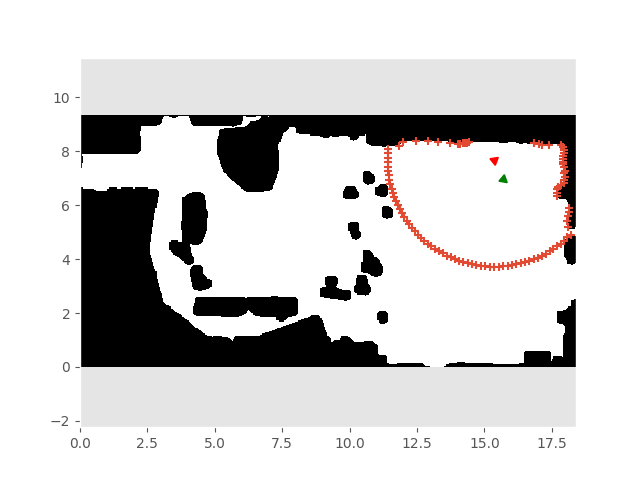
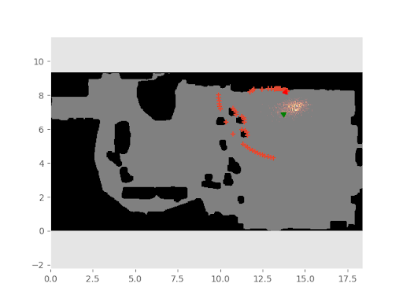
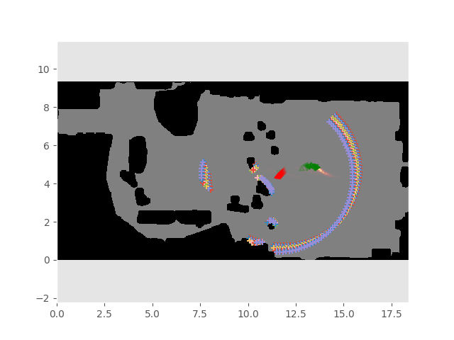

# robot_localization
This repo contains the code for the final project in class CSE571:Robotics in University of Washington. It implements various nerual networks including mobilenet, cVAE, and sequential cVAE for robot localization. Below is an example of predicted robot's state from different models.

| classification      | cVAE     | Sequential-cVAE     |
|------------|-------------|-------------|
|  |  | |

